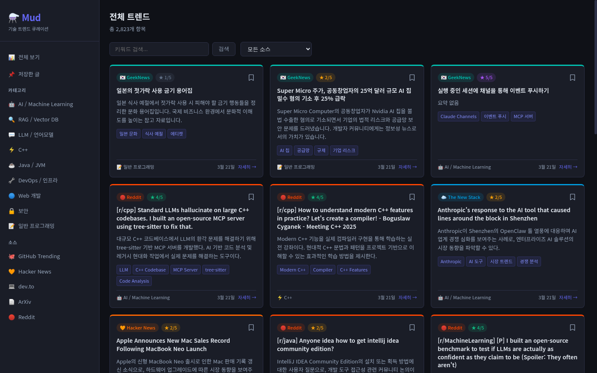
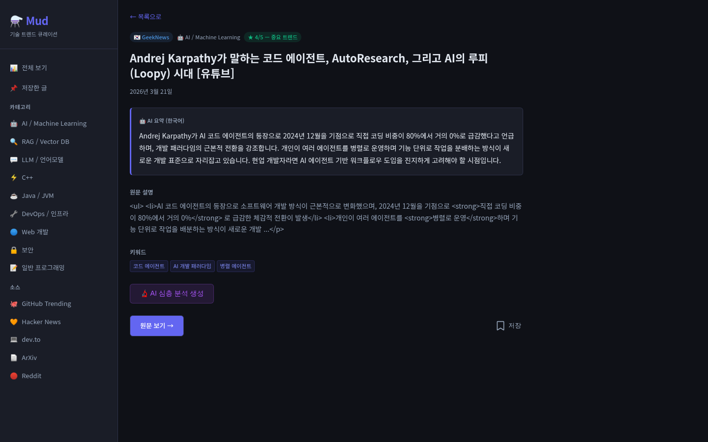

# ⚗️ Mud

**AI가 매일 읽어주는 기술 뉴스룸**

18개 글로벌 테크 소스를 30분마다 자동 수집하고, Claude AI가 한국어로 요약·분석·점수화하여 개발자에게 큐레이션 해주는 기술 트렌드 플랫폼입니다.





## 주요 기능

- **18개 소스 자동 수집** — GitHub Trending, Hacker News, ArXiv, Dev.to, Reddit 등 30분 주기 크롤링
- **AI 한국어 요약** — Claude AI가 영문 기사를 한국어로 요약하고 관련성 점수(1~5) 부여
- **심층 분석** — 클릭 한 번으로 최대 4,096 토큰의 AI 심층 분석 생성
- **9개 카테고리 분류** — AI/ML, LLM, RAG, DevOps, Web, Security, Java, C++, 일반 프로그래밍
- **다양한 필터** — 카테고리, 소스, 점수, 키워드로 원하는 트렌드만 탐색
- **북마크** — 관심 트렌드를 저장하고 나중에 다시 확인

## 수집 소스

| 분야 | 소스 |
|------|------|
| **오픈소스 / 개발** | GitHub Trending · Dev.to · Lobsters · Stack Overflow Blog · Martin Fowler |
| **AI / ML 연구** | ArXiv · Papers With Code · Hugging Face |
| **종합 기술 미디어** | Hacker News · InfoQ · GeekNews · TLDR |
| **클라우드 / 인프라** | The New Stack · CNCF |
| **언어 / 도구** | Inside Java · isocpp.org · JetBrains · Reddit |

## 기술 스택

### Backend

| 기술 | 버전 |
|------|------|
| Java | 21 |
| Spring Boot | 3.2.3 |
| PostgreSQL | 16 |
| Redis | 7 |
| Flyway | DB 마이그레이션 |
| Quartz | 크롤링 스케줄링 |
| JSoup | HTML 파싱 |

### Frontend

| 기술 | 버전 |
|------|------|
| Next.js | 14 (App Router) |
| React | 18 |
| TypeScript | 5 (strict mode) |
| react-markdown | 10.1 |

### Infrastructure

| 기술 | 용도 |
|------|------|
| Docker Compose | 로컬 개발 및 프로덕션 |
| Nginx | 리버스 프록시 |
| Railway | 프로덕션 배포 |
| GitHub Actions | CI/CD |

## 아키텍처

```
[18개 Tech Sources]
       │
       ▼
[Crawler (JSoup/WebClient)] ──30분 주기──▶ [PostgreSQL]
                                                │
                                                ▼
                                    [AnalysisService]
                                    Claude AI 요약·분류·점수
                                                │
                                                ▼
                                          [Redis Cache]
                                                │
                                                ▼
[User] → [Nginx] → [Next.js 14 SSR] → [Spring Boot REST API]
```

## 시작하기

### 사전 요구사항

- Docker & Docker Compose
- Claude API Key ([console.anthropic.com](https://console.anthropic.com))

### 1. 환경 변수 설정

```bash
cp .env.example .env
```

`.env` 파일을 열고 Claude API Key를 입력합니다:

```
CLAUDE_API_KEY=sk-ant-xxxxx
```

### 2. Docker Compose로 실행

```bash
# 개발 모드
docker-compose up

# 프로덕션 모드
docker-compose -f docker-compose.prod.yml up
```

서비스가 시작되면:
- **Frontend**: http://localhost:4000/trends
- **Backend API**: http://localhost:8080/api
- **PostgreSQL**: localhost:5432
- **Redis**: localhost:6379

### 3. 개별 실행 (Docker 없이)

**Backend:**

```bash
cd mud-backend
./gradlew bootRun    # PostgreSQL, Redis가 실행 중이어야 합니다
```

**Frontend:**

```bash
cd mud-frontend
npm ci
npm run dev          # http://localhost:3000
```

## API

| Method | Endpoint | 설명 |
|--------|----------|------|
| GET | `/api/trends` | 트렌드 목록 (페이지네이션, 필터링) |
| GET | `/api/trends/{id}` | 트렌드 상세 |
| POST | `/api/trends/{id}/deep-analysis` | AI 심층 분석 트리거 |
| GET | `/api/categories` | 카테고리 목록 |
| GET | `/api/stats` | 통계 (소스별, 카테고리별) |
| GET | `/api/health` | 헬스 체크 |

### 필터 파라미터 (`/api/trends`)

| 파라미터 | 타입 | 설명 |
|----------|------|------|
| `page` | int | 페이지 번호 (0부터) |
| `size` | int | 페이지 크기 (기본 20) |
| `category` | string | 카테고리 slug |
| `source` | string | 소스 이름 |
| `minScore` | int | 최소 관련성 점수 (1~5) |
| `keyword` | string | 키워드 검색 |

## 프로젝트 구조

```
mud/
├── mud-backend/
│   └── src/main/java/com/mud/backend/
│       ├── crawler/          # 18개 크롤러 (JSoup 기반)
│       ├── service/          # 분석, 크롤링 비즈니스 로직
│       ├── api/controller/   # REST API 컨트롤러
│       ├── domain/           # JPA 엔티티
│       ├── repository/       # Spring Data JPA
│       ├── config/           # Redis, CORS, Quartz 설정
│       └── scheduler/        # 크롤링 스케줄러 (Quartz)
│
├── mud-frontend/
│   └── src/
│       ├── app/              # Next.js App Router 페이지
│       │   ├── trends/       # 트렌드 목록
│       │   ├── trends/[id]/  # 트렌드 상세 + 심층분석
│       │   └── bookmarks/    # 북마크
│       ├── components/       # Sidebar, FilterBar, TrendCard 등
│       ├── hooks/            # useBookmarks 등 커스텀 훅
│       └── lib/              # API 클라이언트, Server Actions
│
├── nginx/                    # Nginx 리버스 프록시 설정
├── .github/workflows/        # CI/CD (테스트 + Railway 배포)
├── docker-compose.yml        # 개발 환경
└── docker-compose.prod.yml   # 프로덕션 환경
```

## 데이터 파이프라인

1. **수집** — Quartz 스케줄러가 30분마다 18개 크롤러를 실행. JSoup으로 HTML 파싱, WebClient로 RSS/API 호출. URL 해시로 중복 방지.

2. **분석** — 새로 수집된 아이템(PENDING)을 Claude AI(claude-haiku-4-5)로 배치 분석. 한국어 요약, 카테고리 분류, 관련성 점수(1~5), 키워드 추출.

3. **캐싱** — Redis에 계층별 TTL 적용 (트렌드 목록 5분, 상세 30분, 카테고리 1시간, 통계 10분). Redis 장애 시 DB 자동 폴백.

4. **심층 분석** — 사용자 요청 시 Claude AI(claude-sonnet-4-6)로 최대 4,096 토큰의 상세 분석 생성.

## 기여하기

이슈와 PR을 환영합니다.

1. Fork & Clone
2. 브랜치 생성 (`git checkout -b feature/my-feature`)
3. 변경 후 커밋
4. PR 생성

## 라이선스

MIT License
